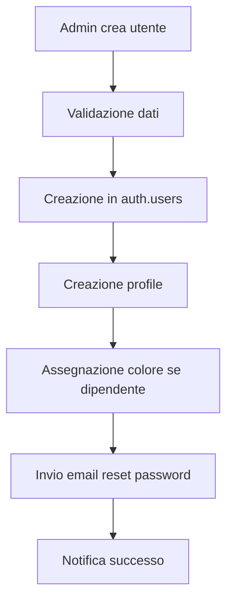
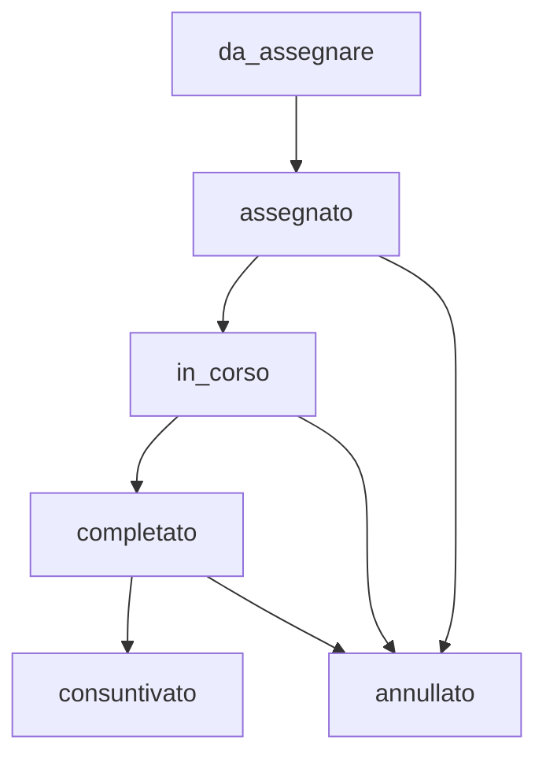
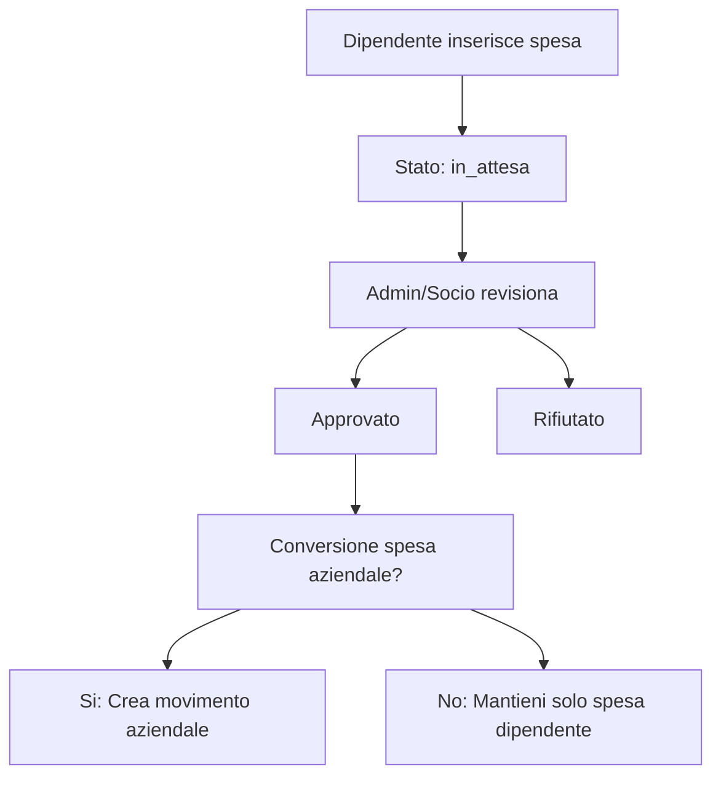

# DOCUMENTAZIONE PROGETTO COMPLETA: TAXITIME

## 📋 INDICE

1. [Panoramica del Sistema](#panoramica-del-sistema)
2. [Architettura Tecnica](#architettura-tecnica)
3. [Schema Database](#schema-database)
4. [Sistema di Autenticazione e Ruoli](#sistema-di-autenticazione-e-ruoli)
5. [Moduli Funzionali](#moduli-funzionali)
6. [Edge Functions](#edge-functions)
7. [Logiche di Business](#logiche-di-business)
8. [Prompt per Implementazione Completa](#prompt-per-implementazione-completa)
9. [Prompt MVP](#prompt-mvp)

---

## 📊 PANORAMICA DEL SISTEMA

### Descrizione
TaxiTime è una piattaforma web completa per la gestione di servizi taxi, che permette la gestione di:
- Aziende clienti e loro dipendenti/passeggeri
- Servizi taxi con workflow completo
- Stipendi e spese dipendenti
- Turni di lavoro
- Report automatici in PDF
- Dashboard differenziate per ruolo

### Tipologia Utenti
- **Admin**: Gestione completa sistema
- **Socio**: Gestione operativa e stipendi
- **Dipendente**: Visualizzazione propri dati e inserimento turni/spese
- **Cliente**: Gestione servizi della propria azienda

---

## 🏗️ ARCHITETTURA TECNICA

### Stack Tecnologico
```typescript
// Frontend
- React 18 + TypeScript
- Vite (build tool)
- Tailwind CSS (styling)
- Radix UI (componenti base)
- TanStack Query (state management)
- React Hook Form + Zod (form validation)
- React Router DOM (routing)
- Lucide React (icone)

// Backend
- Supabase (BaaS)
- PostgreSQL (database)
- Row Level Security (RLS)
- Edge Functions (Deno)
- Storage (file management)

// Utility
- date-fns (date manipulation)
- jsPDF + autotable (PDF generation)
- Sonner (toast notifications)
- React Signature Canvas (firma digitale)
```

### Struttura Progetto
```
src/
├── components/           # Componenti riutilizzabili
│   ├── auth/            # Componenti autenticazione
│   ├── aziende/         # Gestione aziende
│   ├── servizi/         # Gestione servizi
│   ├── stipendi/        # Sistema stipendi
│   ├── shifts/          # Gestione turni
│   ├── spese/           # Gestione spese
│   ├── reports/         # Sistema report
│   ├── users/           # Gestione utenti
│   ├── layouts/         # Layout applicazione
│   └── ui/              # Componenti UI base
├── hooks/               # Custom hooks
├── lib/                 # Utility e API
│   ├── api/             # API calls
│   ├── types/           # TypeScript types
│   └── utils/           # Utility functions
├── pages/               # Pagine routing
├── contexts/            # React contexts
└── integrations/        # Integrazioni esterne
    └── supabase/        # Client Supabase
```

---

## 🗄️ SCHEMA DATABASE

### Tabelle Principali

#### 1. **profiles** - Profili Utenti
```sql
CREATE TABLE profiles (
  id UUID PRIMARY KEY DEFAULT auth.uid(),
  azienda_id UUID REFERENCES aziende(id),
  first_name TEXT,
  last_name TEXT,
  role TEXT NOT NULL CHECK (role IN ('admin', 'socio', 'dipendente', 'cliente')),
  email TEXT,
  telefono TEXT,
  color TEXT -- Per calendario dipendenti
);
```

#### 2. **aziende** - Aziende Clienti
```sql
CREATE TABLE aziende (
  id UUID PRIMARY KEY DEFAULT gen_random_uuid(),
  nome TEXT NOT NULL,
  partita_iva TEXT NOT NULL UNIQUE,
  email TEXT,
  telefono TEXT,
  emails TEXT[] DEFAULT '{}',
  telefoni TEXT[] DEFAULT '{}',
  indirizzo TEXT,
  citta TEXT,
  sdi TEXT,
  pec TEXT,
  firma_digitale_attiva BOOLEAN DEFAULT false,
  provvigione BOOLEAN DEFAULT false,
  created_at TIMESTAMPTZ DEFAULT now()
);
```

#### 3. **servizi** - Servizi Taxi
```sql
CREATE TABLE servizi (
  id UUID PRIMARY KEY DEFAULT gen_random_uuid(),
  azienda_id UUID NOT NULL REFERENCES aziende(id),
  referente_id UUID NOT NULL REFERENCES profiles(id),
  data_servizio DATE NOT NULL,
  orario_servizio TIME DEFAULT '12:00',
  indirizzo_presa TEXT NOT NULL,
  indirizzo_destinazione TEXT NOT NULL,
  citta_presa TEXT,
  citta_destinazione TEXT,
  stato TEXT DEFAULT 'da_assegnare' CHECK (stato IN (
    'da_assegnare', 'assegnato', 'in_corso', 
    'completato', 'consuntivato', 'annullato'
  )),
  assegnato_a UUID REFERENCES profiles(id),
  conducente_esterno BOOLEAN DEFAULT false,
  conducente_esterno_id UUID REFERENCES conducenti_esterni(id),
  conducente_esterno_nome TEXT,
  conducente_esterno_email TEXT,
  veicolo_id UUID REFERENCES veicoli(id),
  metodo_pagamento TEXT NOT NULL,
  incasso_previsto NUMERIC,
  incasso_ricevuto NUMERIC,
  ore_lavorate NUMERIC,
  ore_effettive NUMERIC,
  ore_fatturate NUMERIC,
  ore_finali NUMERIC,
  iva NUMERIC DEFAULT 22.0,
  numero_commessa TEXT,
  note TEXT,
  firma_url TEXT,
  firma_timestamp TIMESTAMPTZ,
  consegna_contanti_a UUID REFERENCES profiles(id),
  created_at TIMESTAMPTZ DEFAULT now(),
  created_by UUID NOT NULL REFERENCES profiles(id)
);
```

#### 4. **passeggeri** - Passeggeri Aziende
```sql
CREATE TABLE passeggeri (
  id UUID PRIMARY KEY DEFAULT gen_random_uuid(),
  azienda_id UUID NOT NULL REFERENCES aziende(id),
  referente_id UUID REFERENCES profiles(id),
  nome_cognome TEXT NOT NULL,
  nome TEXT,
  cognome TEXT,
  email TEXT,
  telefono TEXT,
  localita TEXT,
  indirizzo TEXT,
  created_at TIMESTAMPTZ DEFAULT now()
);
```

#### 5. **servizi_passeggeri** - Collegamento Servizi-Passeggeri
```sql
CREATE TABLE servizi_passeggeri (
  id UUID PRIMARY KEY DEFAULT gen_random_uuid(),
  servizio_id UUID NOT NULL REFERENCES servizi(id),
  passeggero_id UUID NOT NULL REFERENCES passeggeri(id),
  orario_presa_personalizzato TIME,
  usa_indirizzo_personalizzato BOOLEAN DEFAULT false,
  luogo_presa_personalizzato TEXT,
  destinazione_personalizzato TEXT,
  created_at TIMESTAMPTZ DEFAULT now()
);
```

#### 6. **shifts** - Turni Dipendenti
```sql
CREATE TABLE shifts (
  id UUID PRIMARY KEY DEFAULT gen_random_uuid(),
  user_id UUID NOT NULL REFERENCES profiles(id),
  shift_date DATE NOT NULL,
  shift_type VARCHAR NOT NULL CHECK (shift_type IN (
    'full_day', 'half_day_morning', 'half_day_afternoon', 
    'sick_leave', 'vacation'
  )),
  half_day_type VARCHAR,
  start_time TIME,
  end_time TIME,
  start_date DATE,
  end_date DATE,
  notes TEXT,
  created_at TIMESTAMPTZ DEFAULT now(),
  created_by UUID NOT NULL REFERENCES profiles(id),
  updated_at TIMESTAMPTZ DEFAULT now(),
  updated_by UUID NOT NULL REFERENCES profiles(id)
);
```

#### 7. **stipendi** - Stipendi Dipendenti
```sql
CREATE TABLE stipendi (
  id UUID PRIMARY KEY DEFAULT gen_random_uuid(),
  user_id UUID NOT NULL REFERENCES profiles(id),
  mese INTEGER NOT NULL CHECK (mese BETWEEN 1 AND 12),
  anno INTEGER NOT NULL,
  tipo_calcolo TEXT NOT NULL CHECK (tipo_calcolo IN ('km', 'percentuale')),
  totale_km NUMERIC,
  totale_ore_lavorate NUMERIC,
  totale_ore_attesa NUMERIC,
  base_calcolo NUMERIC,
  coefficiente_applicato NUMERIC,
  totale_lordo NUMERIC,
  totale_spese NUMERIC,
  totale_prelievi NUMERIC,
  incassi_da_dipendenti NUMERIC,
  riporto_mese_precedente NUMERIC,
  totale_netto NUMERIC,
  percentuale_su_totale NUMERIC,
  stato TEXT DEFAULT 'bozza' CHECK (stato IN ('bozza', 'confermato', 'pagato')),
  note TEXT,
  created_at TIMESTAMPTZ DEFAULT now(),
  updated_at TIMESTAMPTZ DEFAULT now(),
  created_by UUID NOT NULL REFERENCES profiles(id)
);
```

#### 8. **configurazione_stipendi** - Configurazione Calcolo Stipendi
```sql
CREATE TABLE configurazione_stipendi (
  id UUID PRIMARY KEY DEFAULT gen_random_uuid(),
  anno INTEGER NOT NULL UNIQUE,
  coefficiente_aumento NUMERIC NOT NULL,
  tariffa_oraria_attesa NUMERIC DEFAULT 15.00,
  tariffa_km_extra NUMERIC DEFAULT 0.28,
  created_at TIMESTAMPTZ DEFAULT now(),
  updated_at TIMESTAMPTZ DEFAULT now()
);
```

#### 9. **tariffe_km** - Tariffe Progressive per KM
```sql
CREATE TABLE tariffe_km (
  id UUID PRIMARY KEY DEFAULT gen_random_uuid(),
  km INTEGER NOT NULL,
  tariffa_base NUMERIC NOT NULL,
  anno INTEGER DEFAULT EXTRACT(year FROM CURRENT_DATE),
  created_at TIMESTAMPTZ DEFAULT now()
);
```

#### 10. **spese_dipendenti** - Spese Dipendenti
```sql
CREATE TABLE spese_dipendenti (
  id UUID PRIMARY KEY DEFAULT gen_random_uuid(),
  user_id UUID NOT NULL REFERENCES profiles(id),
  data_spesa DATE DEFAULT CURRENT_DATE,
  importo NUMERIC NOT NULL,
  causale TEXT NOT NULL,
  note TEXT,
  stato TEXT DEFAULT 'in_attesa' CHECK (stato IN ('in_attesa', 'approvato', 'rifiutato')),
  note_revisione TEXT,
  registered_by UUID NOT NULL REFERENCES profiles(id),
  approved_by UUID REFERENCES profiles(id),
  approved_at TIMESTAMPTZ,
  converted_to_spesa_aziendale BOOLEAN DEFAULT false,
  created_at TIMESTAMPTZ DEFAULT now()
);
```

### Tabelle di Sistema e Configurazione

#### 11. **veicoli** - Veicoli Aziendali
```sql
CREATE TABLE veicoli (
  id UUID PRIMARY KEY DEFAULT gen_random_uuid(),
  modello TEXT NOT NULL,
  targa TEXT NOT NULL UNIQUE,
  anno INTEGER,
  colore TEXT,
  numero_posti INTEGER,
  attivo BOOLEAN DEFAULT true,
  note TEXT,
  created_at TIMESTAMPTZ DEFAULT now(),
  updated_at TIMESTAMPTZ DEFAULT now(),
  created_by UUID NOT NULL REFERENCES profiles(id)
);
```

#### 12. **conducenti_esterni** - Conducenti Esterni
```sql
CREATE TABLE conducenti_esterni (
  id UUID PRIMARY KEY DEFAULT gen_random_uuid(),
  nome_cognome TEXT NOT NULL,
  email TEXT,
  telefono TEXT,
  attivo BOOLEAN DEFAULT true,
  note TEXT,
  created_at TIMESTAMPTZ DEFAULT now(),
  updated_at TIMESTAMPTZ DEFAULT now(),
  created_by UUID NOT NULL REFERENCES profiles(id)
);
```

#### 13. **reports** - Report Generati
```sql
CREATE TABLE reports (
  id UUID PRIMARY KEY DEFAULT gen_random_uuid(),
  azienda_id UUID NOT NULL REFERENCES aziende(id),
  referente_id UUID REFERENCES profiles(id),
  data_inizio DATE NOT NULL,
  data_fine DATE NOT NULL,
  numero_servizi INTEGER DEFAULT 0,
  totale_imponibile NUMERIC DEFAULT 0,
  totale_iva NUMERIC DEFAULT 0,
  totale_documento NUMERIC DEFAULT 0,
  nome_file TEXT NOT NULL,
  url_file TEXT,
  bucket_name TEXT DEFAULT 'report_aziende',
  stato TEXT DEFAULT 'in_generazione' CHECK (stato IN (
    'in_generazione', 'completato', 'errore'
  )),
  errore_messaggio TEXT,
  created_at TIMESTAMPTZ DEFAULT now(),
  updated_at TIMESTAMPTZ DEFAULT now(),
  created_by UUID NOT NULL REFERENCES profiles(id)
);
```

#### 14. **spese_aziendali** - Movimenti Aziendali
```sql
CREATE TABLE spese_aziendali (
  id UUID PRIMARY KEY DEFAULT gen_random_uuid(),
  data_movimento DATE NOT NULL,
  importo NUMERIC NOT NULL,
  causale TEXT NOT NULL,
  tipologia TEXT NOT NULL CHECK (tipologia IN ('incasso', 'spesa')),
  modalita_pagamento_id UUID NOT NULL REFERENCES modalita_pagamenti(id),
  stato_pagamento TEXT DEFAULT 'completato' CHECK (stato_pagamento IN (
    'completato', 'in_attesa', 'annullato'
  )),
  socio_id UUID REFERENCES profiles(id),
  note TEXT,
  created_at TIMESTAMPTZ DEFAULT now(),
  created_by UUID NOT NULL REFERENCES profiles(id)
);
```

### Tabelle di Supporto

#### 15. **modalita_pagamenti** - Modalità Pagamento
```sql
CREATE TABLE modalita_pagamenti (
  id UUID PRIMARY KEY DEFAULT gen_random_uuid(),
  nome TEXT NOT NULL UNIQUE,
  attivo BOOLEAN DEFAULT true,
  created_at TIMESTAMPTZ DEFAULT now()
);
```

#### 16. **user_deletion_backup** - Backup Eliminazioni Utenti
```sql
CREATE TABLE user_deletion_backup (
  id UUID PRIMARY KEY DEFAULT gen_random_uuid(),
  deleted_user_id UUID NOT NULL,
  deleted_at TIMESTAMPTZ DEFAULT now(),
  deleted_by UUID NOT NULL REFERENCES profiles(id),
  user_data JSONB,
  servizi_data JSONB DEFAULT '[]',
  stipendi_data JSONB DEFAULT '[]',
  spese_data JSONB DEFAULT '[]',
  turni_data JSONB DEFAULT '[]',
  altri_dati JSONB DEFAULT '{}',
  created_at TIMESTAMPTZ DEFAULT now()
);
```

#### 17. **admin_impersonation_log** - Log Impersonificazioni Admin
```sql
CREATE TABLE admin_impersonation_log (
  id UUID PRIMARY KEY DEFAULT gen_random_uuid(),
  admin_user_id UUID NOT NULL REFERENCES profiles(id),
  target_user_id UUID NOT NULL REFERENCES profiles(id),
  session_start TIMESTAMPTZ DEFAULT now(),
  session_end TIMESTAMPTZ,
  ip_address TEXT,
  user_agent TEXT,
  created_at TIMESTAMPTZ DEFAULT now()
);
```

#### 18. **feedback** - Sistema Feedback
```sql
CREATE TABLE feedback (
  id UUID PRIMARY KEY DEFAULT gen_random_uuid(),
  user_id UUID REFERENCES profiles(id),
  tipo TEXT NOT NULL CHECK (tipo IN ('bug', 'feature', 'improvement', 'other')),
  pagina TEXT NOT NULL,
  messaggio TEXT NOT NULL,
  email TEXT,
  status TEXT DEFAULT 'nuovo' CHECK (status IN ('nuovo', 'in_lavorazione', 'risolto', 'chiuso')),
  admin_comment TEXT,
  user_agent TEXT,
  url TEXT,
  timestamp TIMESTAMPTZ DEFAULT now(),
  created_at TIMESTAMPTZ DEFAULT now(),
  resolved_at TIMESTAMPTZ,
  resolved_by UUID REFERENCES profiles(id)
);
```

#### 19-22. **Tabelle Configurazione**
```sql
-- Impostazioni generali
CREATE TABLE impostazioni (
  id UUID PRIMARY KEY DEFAULT gen_random_uuid(),
  nome_azienda TEXT NOT NULL DEFAULT '',
  partita_iva TEXT,
  indirizzo_sede TEXT,
  telefono TEXT,
  email TEXT,
  metodi_pagamento JSONB DEFAULT '[]',
  aliquote_iva JSONB DEFAULT '[]',
  created_at TIMESTAMPTZ DEFAULT now(),
  updated_at TIMESTAMPTZ DEFAULT now()
);

-- Categorie spese
CREATE TABLE spese_categorie (
  id UUID PRIMARY KEY DEFAULT gen_random_uuid(),
  nome TEXT NOT NULL UNIQUE,
  descrizione TEXT,
  created_at TIMESTAMPTZ DEFAULT now()
);

-- Metodi pagamento spese
CREATE TABLE metodi_pagamento_spese (
  id UUID PRIMARY KEY DEFAULT gen_random_uuid(),
  nome TEXT NOT NULL UNIQUE,
  descrizione TEXT,
  created_at TIMESTAMPTZ DEFAULT now()
);

-- Movimenti aziendali (sistema avanzato)
CREATE TYPE movimento_tipo AS ENUM ('incasso', 'spesa', 'prelievo', 'versamento');
CREATE TYPE movimento_stato AS ENUM ('pending', 'completed', 'cancelled');

CREATE TABLE movimenti_aziendali (
  id UUID PRIMARY KEY DEFAULT gen_random_uuid(),
  data DATE DEFAULT CURRENT_DATE,
  importo NUMERIC NOT NULL,
  causale TEXT NOT NULL,
  tipo movimento_tipo NOT NULL,
  stato movimento_stato DEFAULT 'pending',
  metodo_pagamento_id UUID REFERENCES modalita_pagamenti(id),
  effettuato_da_id UUID REFERENCES profiles(id),
  servizio_id UUID REFERENCES servizi(id),
  spesa_personale_id UUID REFERENCES spese_dipendenti(id),
  note TEXT,
  created_by UUID NOT NULL REFERENCES profiles(id),
  created_at TIMESTAMPTZ DEFAULT now(),
  updated_at TIMESTAMPTZ DEFAULT now()
);

-- Tabella per gestire spese personali separate
CREATE TABLE spese_personali (
  id UUID PRIMARY KEY DEFAULT gen_random_uuid(),
  user_id UUID NOT NULL REFERENCES profiles(id),
  data DATE DEFAULT CURRENT_DATE,
  importo NUMERIC NOT NULL,
  causale TEXT NOT NULL,
  note TEXT,
  convertita_aziendale BOOLEAN DEFAULT false,
  created_at TIMESTAMPTZ DEFAULT now(),
  updated_at TIMESTAMPTZ DEFAULT now()
);
```

---

## 🔐 SISTEMA DI AUTENTICAZIONE E RUOLI

### Ruoli e Permessi

#### **Admin** (Amministratore Sistema)
```typescript
// Permessi completi su tutto
- Gestione utenti (CRUD, impersonation, backup/delete)
- Gestione aziende (CRUD completo)
- Gestione servizi (visione globale, assegnazione)
- Stipendi (calcolo, modifica, configurazione)
- Spese (approvazione, gestione categoriche)
- Configurazioni sistema
- Report completi
- Impostazioni globali
```

#### **Socio** (Partner Operativo)
```typescript
// Gestione operativa
- Visualizzazione tutti i servizi
- Assegnazione e gestione servizi
- Gestione stipendi dipendenti
- Approvazione spese dipendenti
- Creazione e gestione aziende
- Generazione report
- Gestione turni (tutti gli utenti)
- Accesso dashboard operativa
```

#### **Dipendente** (Autista/Operatore)
```typescript
// Accesso limitato ai propri dati
- Visualizzazione propri servizi assegnati
- Inserimento e gestione propri turni
- Inserimento spese personali
- Visualizzazione proprio stipendio
- Firma digitale servizi
- Aggiornamento stato servizi assegnati
```

#### **Cliente** (Referente Azienda)
```typescript
// Gestione servizi della propria azienda
- Creazione e gestione servizi propria azienda
- Gestione passeggeri azienda
- Visualizzazione report azienda
- Gestione dati azienda (limitata)
- Dashboard azienda
```

### Row Level Security (RLS) Implementata

#### Esempi Policy Principali
```sql
-- Policy servizi - Admin e soci vedono tutto
CREATE POLICY "Admin e soci possono aggiornare tutti i servizi" 
ON servizi FOR UPDATE 
USING ((SELECT role FROM profiles WHERE id = auth.uid()) IN ('admin', 'socio'));

-- Policy servizi - Clienti vedono solo propri servizi
CREATE POLICY "Gli utenti possono visualizzare i propri servizi" 
ON servizi FOR SELECT 
USING (
  auth.uid() = created_by OR 
  (SELECT role FROM profiles WHERE id = auth.uid()) IN ('admin', 'socio')
);

-- Policy stipendi - Dipendenti vedono solo i propri
CREATE POLICY "Dipendenti can view own stipendi" 
ON stipendi FOR SELECT 
USING (
  (get_user_role(auth.uid()) = 'dipendente' AND user_id = auth.uid()) OR
  get_user_role(auth.uid()) IN ('admin', 'socio')
);

-- Policy spese dipendenti
CREATE POLICY "Dipendenti possono inserire le proprie spese" 
ON spese_dipendenti FOR INSERT 
WITH CHECK (auth.uid() = user_id);
```

### Funzioni Database per RLS
```sql
-- Funzione helper per ottenere ruolo utente
CREATE OR REPLACE FUNCTION get_user_role(user_id UUID)
RETURNS TEXT
LANGUAGE SQL STABLE SECURITY DEFINER
AS $$
  SELECT role FROM profiles WHERE id = user_id;
$$;

-- Trigger per assegnazione colori dipendenti
CREATE OR REPLACE FUNCTION assign_employee_color()
RETURNS TRIGGER AS $$
DECLARE
  colors TEXT[] := ARRAY[
    '#3B82F6', '#EF4444', '#10B981', '#F59E0B', '#8B5CF6', 
    '#EC4899', '#06B6D4', '#84CC16', '#F97316', '#6366F1'
  ];
  -- ... logica assegnazione colore
$$;
```

---

## 🎯 MODULI FUNZIONALI

### 1. **MODULO GESTIONE UTENTI**

#### Funzionalità Core
- **CRUD Utenti**: Creazione, modifica, eliminazione utenti
- **Gestione Ruoli**: Assegnazione e modifica ruoli
- **Impersonation**: Admin può impersonificare altri utenti
- **Backup & Delete**: Backup dati prima eliminazione
- **Reset Password**: Reset password utenti

#### Componenti Principali
```typescript
// src/components/users/
- UsersTable.tsx          // Tabella utenti con filtri
- UserForm.tsx            // Form creazione/modifica utente
- UserFormFields.tsx      // Campi form utente
- ImpersonateButton.tsx   // Pulsante impersonificazione
- BackupAndDeleteButton.tsx // Gestione eliminazione sicura

// src/hooks/
- useUsers.tsx            // Hook gestione utenti
- useUserBackups.tsx      // Hook gestione backup

// src/lib/api/users/
- getUsers.ts             // Fetch utenti
- createUser.ts           // Creazione utente
- updateUser.ts           // Aggiornamento utente
- deleteUser.ts           // Eliminazione utente
- resetPassword.ts        // Reset password
- backupAndDeleteUser.ts  // Backup e eliminazione
```

#### API Endpoints
```typescript
// Edge Functions
- /functions/v1/create-user
- /functions/v1/update-user-password
- /functions/v1/backup-and-delete-user
- /functions/v1/impersonate-user

// Database Operations
- GET /rest/v1/profiles
- POST /rest/v1/profiles
- PATCH /rest/v1/profiles
- GET /rest/v1/user_deletion_backup
```

#### Workflow Principale


---

### 2. **MODULO GESTIONE AZIENDE**

#### Funzionalità Core
- **CRUD Aziende**: Gestione completa aziende clienti
- **Gestione Referenti**: Assegnazione referenti azienda
- **Configurazione Fatturazione**: Gestione dati fatturazione
- **Firma Digitale**: Abilitazione firma digitale per azienda
- **Provvigioni**: Gestione sistema provvigioni

#### Componenti Principali
```typescript
// src/components/aziende/
- AziendeTable.tsx        // Tabella aziende
- AziendaForm.tsx         // Form azienda
- AziendaFormFields.tsx   // Campi form
- ReferentiManager.tsx    // Gestione referenti

// src/lib/api/aziende/
- getAziende.ts           // Fetch aziende
- createAzienda.ts        // Creazione azienda
- updateAzienda.ts        // Aggiornamento azienda
- deleteAzienda.ts        // Eliminazione azienda
```

#### Schema Validazione
```typescript
export interface AziendaFormData {
  nome: string;
  partita_iva: string;
  email?: string;
  telefono?: string;
  emails?: string[];
  telefoni?: string[];
  indirizzo?: string;
  citta?: string;
  sdi?: string;
  pec?: string;
  firma_digitale_attiva?: boolean;
  provvigione?: boolean;
  provvigione_tipo?: 'fisso' | 'percentuale';
  provvigione_valore?: number;
}
```

---

### 3. **MODULO GESTIONE SERVIZI**

#### Workflow Stati Servizio


#### Stati Servizio Dettagliati
```typescript
type StatoServizio = 
  | 'da_assegnare'    // Servizio creato, da assegnare
  | 'assegnato'       // Assegnato a dipendente/esterno
  | 'in_corso'        // Servizio in esecuzione
  | 'completato'      // Servizio completato
  | 'consuntivato'    // Consuntivato con dati finali
  | 'annullato';      // Servizio annullato
```

#### Funzionalità Core
- **Creazione Servizi**: Form completo con validazione
- **Assegnazione**: Assegnazione a dipendenti interni/esterni
- **Gestione Passeggeri**: Collegamento servizi-passeggeri
- **Calendario**: Vista calendario e timeline
- **Firma Digitale**: Sistema firma tablet/mobile
- **Consuntivazione**: Inserimento dati finali (ore, km, incassi)

#### Componenti Principali
```typescript
// src/components/servizi/
- ServiziTable.tsx           // Tabella servizi
- ServiziFilters.tsx         // Filtri servizi
- ServizioForm.tsx           // Form servizio
- PasseggeriManager.tsx      // Gestione passeggeri
- calendar/
  - CalendarView.tsx         // Vista calendario
  - CalendarGrid.tsx         // Griglia calendario
  - CalendarHeader.tsx       // Header calendario
  - ServiceCard.tsx          // Card servizio
- firma/
  - FirmaDigitaleDialog.tsx  // Dialog firma
  - FirmaCanvas.tsx          // Canvas firma
- consuntivazione/
  - ConsuntivazioneForm.tsx  // Form consuntivazione
```

#### Sistema Firma Digitale
```typescript
// Implementazione firma
const handleFirmaSubmit = async (firma: string) => {
  // 1. Convertir firma canvas to blob
  const blob = dataURLtoBlob(firma);
  
  // 2. Upload to Supabase Storage
  const { data: uploadData, error: uploadError } = await supabase.storage
    .from('firme')
    .upload(`servizi/${servizioId}/firma_${Date.now()}.png`, blob);
  
  // 3. Update servizio with firma URL
  const { error: updateError } = await supabase
    .from('servizi')
    .update({
      firma_url: uploadData?.path,
      firma_timestamp: new Date().toISOString(),
      stato: 'completato'
    })
    .eq('id', servizioId);
};
```

#### Calcolo Automatico Incassi
```typescript
// Trigger per creazione movimento aziendale automatico
CREATE OR REPLACE FUNCTION create_incasso_for_contanti_service()
RETURNS TRIGGER AS $$
BEGIN
  -- Se pagamento contanti e assegnato a socio
  IF NEW.metodo_pagamento = 'Contanti' AND EXISTS (
    SELECT 1 FROM profiles 
    WHERE id = NEW.assegnato_a AND role = 'socio'
  ) THEN
    -- Crea movimento incasso automatico
    INSERT INTO spese_aziendali (
      data_movimento, importo, causale, tipologia,
      modalita_pagamento_id, stato_pagamento, socio_id
    ) VALUES (
      NEW.data_servizio,
      COALESCE(NEW.incasso_ricevuto, NEW.incasso_previsto, 0),
      'Servizio #' || NEW.id || ' eseguito in contanti',
      'incasso',
      (SELECT id FROM modalita_pagamenti WHERE nome = 'Contanti'),
      'completato',
      NEW.assegnato_a
    );
  END IF;
  RETURN NEW;
END;
$$ LANGUAGE plpgsql;
```

---

### 4. **MODULO GESTIONE TURNI**

#### Tipologie Turno
```typescript
type ShiftType = 
  | 'full_day'           // Giornata completa
  | 'half_day_morning'   // Mezza giornata mattina
  | 'half_day_afternoon' // Mezza giornata pomeriggio
  | 'sick_leave'         // Malattia
  | 'vacation';          // Ferie

type HalfDayType = 
  | 'morning'            // 08:00-14:00
  | 'afternoon';         // 14:00-20:00
```

#### Componenti Sistema Turni
```typescript
// src/components/shifts/
- ShiftsTable.tsx            // Tabella turni
- ShiftForm.tsx              // Form turno
- calendar/
  - ShiftCalendarView.tsx    // Vista calendario turni
  - ShiftCalendarGrid.tsx    // Griglia calendario
  - hooks/
    - useCalendarView.tsx    // Hook vista calendario
- ShiftContext.tsx           // Context gestione turni

// src/hooks/
- useShifts.tsx              // Hook turni
- useShiftMutations.tsx      // Hook mutazioni turni
```

#### Context Sistema Turni
```typescript
interface ShiftContextType {
  // State
  shifts: Shift[];
  isLoading: boolean;
  error: Error | null;
  
  // Date management
  dateRange: { start: Date; end: Date };
  setDateRange: (range: { start: Date; end: Date }) => void;
  
  // Filtering
  selectedUserId: string | null;
  setSelectedUserId: (userId: string | null) => void;
  
  // CRUD operations
  createShift: (data: ShiftFormData) => Promise<void>;
  updateShift: (id: string, data: ShiftFormData) => Promise<void>;
  deleteShift: (id: string) => Promise<void>;
  
  // Selection
  selectedShift: Shift | null;
  setSelectedShift: (shift: Shift | null) => void;
}
```

#### Validazione Turni
```typescript
const shiftValidationSchema = z.object({
  user_id: z.string().uuid(),
  shift_date: z.date(),
  shift_type: z.enum(['full_day', 'half_day_morning', 'half_day_afternoon', 'sick_leave', 'vacation']),
  half_day_type: z.enum(['morning', 'afternoon']).optional(),
  start_time: z.string().optional(),
  end_time: z.string().optional(),
  start_date: z.date().optional(),
  end_date: z.date().optional(),
  notes: z.string().optional()
}).refine((data) => {
  // Validazioni custom per coerenza dati
  if (data.shift_type.includes('half_day') && !data.half_day_type) {
    return false;
  }
  return true;
});
```

---

### 5. **MODULO SISTEMA STIPENDI**

#### Tipi Calcolo Stipendio
```typescript
type TipoCalcolo = 'km' | 'percentuale';

interface ConfigurazioneStipendi {
  anno: number;
  coefficiente_aumento: number;
  tariffa_oraria_attesa: number;    // Default: 15.00€
  tariffa_km_extra: number;         // Default: 0.28€
}

interface TariffaKm {
  km: number;
  tariffa_base: number;
  anno: number;
}
```

#### Sistema Tariffe Progressive
```typescript
// Esempio tariffe progressive 2024
const tariffeKm = [
  { km: 10, tariffa_base: 8.50, anno: 2024 },
  { km: 20, tariffa_base: 9.00, anno: 2024 },
  { km: 30, tariffa_base: 9.50, anno: 2024 },
  { km: 50, tariffa_base: 10.00, anno: 2024 },
  { km: 100, tariffa_base: 10.50, anno: 2024 }
];
```

#### Logica Calcolo Stipendi
```typescript
// src/lib/api/stipendi/calcoloStipendi.ts
export async function calcolaStipendio(
  userId: string, 
  mese: number, 
  anno: number, 
  tipoCalcolo: TipoCalcolo
): Promise<StipendioCalcolato> {
  
  // 1. Recupera servizi del mese
  const servizi = await getServiziUtente(userId, mese, anno);
  
  // 2. Calcola totali
  const totaleKm = servizi.reduce((sum, s) => sum + (s.km || 0), 0);
  const totaleOre = servizi.reduce((sum, s) => sum + (s.ore_lavorate || 0), 0);
  const totaleOreAttesa = servizi.reduce((sum, s) => sum + (s.ore_attesa || 0), 0);
  
  // 3. Calcolo basato su tipo
  if (tipoCalcolo === 'km') {
    return calcolaStipendioKm(totaleKm, totaleOre, totaleOreAttesa, anno);
  } else {
    return calcolaStipendioPercentuale(servizi, anno);
  }
}

function calcolaStipendioKm(km: number, ore: number, oreAttesa: number, anno: number) {
  // 1. Trova tariffa km applicabile
  const tariffa = getTariffaKm(km, anno);
  
  // 2. Calcola base
  const baseKm = km * tariffa.tariffa_base;
  const baseOreAttesa = oreAttesa * getTariffaOraria(anno);
  
  // 3. Applica coefficiente aumento
  const coefficiente = getCoefficienteAumento(anno);
  const baseTotale = (baseKm + baseOreAttesa) * coefficiente;
  
  return {
    base_calcolo: baseTotale,
    coefficiente_applicato: coefficiente,
    // ... altri campi
  };
}
```

#### Componenti Stipendi
```typescript
// src/components/stipendi/
- TabellaStipendi.tsx           // Tabella stipendi
- StipendiStats.tsx             // Statistiche
- StipendiFilters.tsx           // Filtri
- StipendiHeader.tsx            // Header con azioni
- NuovoStipendioSheet.tsx       // Form nuovo stipendio
- DettaglioStipendioSheet.tsx   // Dettaglio stipendio
- modifica/
  - ModificaStipendioSheet.tsx  // Form modifica
- ConfermaStatoDialog.tsx       // Conferma cambio stato
- StipendiGuida.tsx             // Guida utente
```

#### Stati Stipendio
```typescript
type StatoStipendio = 'bozza' | 'confermato' | 'pagato';

// Workflow stati
bozza → confermato → pagato
```

---

### 6. **MODULO SPESE E MOVIMENTI**

#### Tipologie Spese
```typescript
// Spese Dipendenti
interface SpesaDipendente {
  user_id: string;
  data_spesa: Date;
  importo: number;
  causale: string;
  note?: string;
  stato: 'in_attesa' | 'approvato' | 'rifiutato';
  note_revisione?: string;
  converted_to_spesa_aziendale: boolean;
}

// Spese Aziendali
interface SpesaAziendale {
  data_movimento: Date;
  importo: number;
  causale: string;
  tipologia: 'incasso' | 'spesa';
  modalita_pagamento_id: string;
  stato_pagamento: 'completato' | 'in_attesa' | 'annullato';
  socio_id?: string;
  note?: string;
}

// Movimenti Aziendali (Sistema Avanzato)
type MovimentoTipo = 'incasso' | 'spesa' | 'prelievo' | 'versamento';
type MovimentoStato = 'pending' | 'completed' | 'cancelled';
```

#### Workflow Approvazione Spese


#### Componenti Spese
```typescript
// src/components/spese/
- SpeseDipendentiTable.tsx      // Tabella spese dipendenti
- SpeseAziendaliTable.tsx       // Tabella spese aziendali
- MovimentiTable.tsx            // Tabella movimenti
- SpesaForm.tsx                 // Form spesa
- ApprovazioneSpese.tsx         // Gestione approvazioni
- filters/
  - SpeseFilters.tsx            // Filtri spese
  - MovimentiFilters.tsx        // Filtri movimenti

// src/lib/api/spese/
- getSpese.ts                   // Fetch spese
- getMovimenti.ts               // Fetch movimenti
- createSpesa.ts                // Creazione spesa
- approveSpesa.ts               // Approvazione spesa
```

---

### 7. **MODULO SISTEMA REPORT**

#### Generazione Report PDF
```typescript
// Edge Function: generate-report
interface ReportParams {
  azienda_id: string;
  referente_id?: string;
  data_inizio: string;
  data_fine: string;
  includi_iva: boolean;
  tipo_report: 'dettagliato' | 'riassuntivo';
}

// Processo generazione
async function generateReport(params: ReportParams) {
  // 1. Validazione parametri
  validateReportParams(params);
  
  // 2. Fetch dati servizi
  const servizi = await fetchServiziReport(params);
  
  // 3. Calcoli totali
  const totali = calcolaTotaliReport(servizi, params.includi_iva);
  
  // 4. Generazione PDF
  const pdfBuffer = await generatePDFReport(servizi, totali, params);
  
  // 5. Upload su Supabase Storage
  const fileName = `report_${params.azienda_id}_${Date.now()}.pdf`;
  const { data: uploadData } = await supabase.storage
    .from('Report Aziende')
    .upload(fileName, pdfBuffer);
  
  // 6. Salvataggio record report
  const { data: reportData } = await supabase
    .from('reports')
    .insert({
      azienda_id: params.azienda_id,
      referente_id: params.referente_id,
      data_inizio: params.data_inizio,
      data_fine: params.data_fine,
      numero_servizi: servizi.length,
      totale_imponibile: totali.imponibile,
      totale_iva: totali.iva,
      totale_documento: totali.totale,
      nome_file: fileName,
      url_file: uploadData?.path,
      stato: 'completato'
    });
  
  return reportData;
}
```

#### Template PDF Report
```typescript
// Struttura PDF Report
const generatePDFReport = async (servizi, totali, params) => {
  const doc = new jsPDF();
  
  // Header azienda
  doc.setFontSize(16);
  doc.text('Report Servizi - ' + azienda.nome, 20, 20);
  
  // Periodo report
  doc.setFontSize(12);
  doc.text(`Periodo: ${params.data_inizio} - ${params.data_fine}`, 20, 30);
  
  // Tabella servizi
  autoTable(doc, {
    head: [['Data', 'Servizio', 'Passeggero', 'Importo']],
    body: servizi.map(s => [
      format(new Date(s.data_servizio), 'dd/MM/yyyy'),
      `${s.indirizzo_presa} → ${s.indirizzo_destinazione}`,
      s.passeggeri?.map(p => p.nome_cognome).join(', ') || '',
      '€ ' + (s.incasso_previsto || 0).toFixed(2)
    ]),
    startY: 40
  });
  
  // Totali
  const finalY = doc.lastAutoTable.finalY + 10;
  doc.text(`Totale Imponibile: € ${totali.imponibile.toFixed(2)}`, 20, finalY);
  
  if (params.includi_iva) {
    doc.text(`IVA: € ${totali.iva.toFixed(2)}`, 20, finalY + 10);
    doc.text(`Totale Documento: € ${totali.totale.toFixed(2)}`, 20, finalY + 20);
  }
  
  return doc.output('arraybuffer');
};
```

#### Componenti Report
```typescript
// src/components/reports/
- ReportsTable.tsx              // Tabella report generati
- GenerateReportDialog.tsx      // Dialog generazione report
- ReportFilters.tsx             // Filtri report
- ReportPreview.tsx             // Anteprima report
- ReportDownload.tsx            // Download report

// src/hooks/
- useGenerateReport.tsx         // Hook generazione report
- useReports.tsx                // Hook gestione report
```

---

### 8. **MODULO DASHBOARD**

#### Dashboard per Ruolo

#### **Dashboard Admin**
```typescript
interface AdminDashboardData {
  // Statistiche generali
  totaleUtenti: number;
  totaleAziende: number;
  serviziMese: number;
  fatturatoMese: number;
  
  // Grafici
  andamentoServizi: SerieTemporale[];
  distribuzioneTipiServizio: DistribuzioneData[];
  topAziende: AziendaStats[];
  
  // Attività recenti
  ultimiServizi: ServizioRecente[];
  ultimiUtenti: UtenteRecente[];
  
  // Alerts
  speseInAttesa: number;
  reportInErrore: number;
  utentiInattivi: number;
}
```

#### **Dashboard Socio**
```typescript
interface SocioDashboardData {
  // Focus operativo
  serviziGiorno: ServizioGiorno[];
  dipendentiTurno: DipendenteTurno[];
  serviziDaAssegnare: Servizio[];
  
  // Statistiche periodo
  serviziCompletati: number;
  orelavorate: number;
  incassiTotali: number;
  
  // Gestione spese
  speseInAttesa: SpesaDipendente[];
  movimentiRecenti: MovimentoAziendale[];
}
```

#### **Dashboard Dipendente**
```typescript
interface DipendenteDashboardData {
  // Servizi personali
  serviziOggi: Servizio[];
  prossimiServizi: Servizio[];
  
  // Statistiche personali
  serviziMese: number;
  kmPercorsi: number;
  orelavorate: number;
  
  // Stipendio
  stipendioCorrente?: Stipendio;
  speseInAttesa: SpesaDipendente[];
  
  // Turni
  turniSettimanali: Shift[];
}
```

#### **Dashboard Cliente**
```typescript
interface ClienteDashboardData {
  // Servizi azienda
  serviziInCorso: Servizio[];
  prossimiServizi: Servizio[];
  
  // Statistiche azienda
  serviziMese: number;
  spesaMese: number;
  
  // Passeggeri
  passeggeriAttivi: number;
  passeggeriRecenti: Passeggero[];
  
  // Report
  ultimiReport: Report[];
}
```

#### Componenti Dashboard
```typescript
// src/components/dashboard/
- AdminDashboard.tsx            // Dashboard admin
- SocioDashboard.tsx            // Dashboard socio
- DipendenteDashboard.tsx       // Dashboard dipendente
- ClienteDashboard.tsx          // Dashboard cliente
- stats/
  - StatsCard.tsx               // Card statistica
  - ChartContainer.tsx          // Container grafici
  - ServizioChart.tsx           // Grafico servizi
- recent/
  - RecentActivity.tsx          // Attività recenti
  - ServizioCard.tsx            // Card servizio
  - AlertCard.tsx               // Card alert
```

---

## ⚙️ EDGE FUNCTIONS

### 1. **generate-report** - Generazione Report PDF
```typescript
// supabase/functions/generate-report/index.ts
interface ReportRequest {
  azienda_id: string;
  referente_id?: string;
  data_inizio: string;
  data_fine: string;
  includi_iva: boolean;
  tipo_report: 'dettagliato' | 'riassuntivo';
}

// Processo:
// 1. Autenticazione e autorizzazione
// 2. Validazione parametri
// 3. Fetch servizi per periodo
// 4. Calcolo totali
// 5. Generazione PDF con jsPDF
// 6. Upload su Supabase Storage
// 7. Creazione record in tabella reports
```

### 2. **create-user** - Creazione Utenti
```typescript
// supabase/functions/create-user/index.ts
interface CreateUserRequest {
  email: string;
  first_name: string;
  last_name: string;
  role: 'admin' | 'socio' | 'dipendente' | 'cliente';
  azienda_id?: string;
  telefono?: string;
  password?: string;
}

// Processo:
// 1. Validazione permessi (solo admin/socio)
// 2. Validazione azienda per ruolo cliente
// 3. Creazione utente in Supabase Auth
// 4. Creazione profilo in tabella profiles
// 5. Invio email reset password se necessario
```

### 3. **update-user-password** - Reset Password
```typescript
// supabase/functions/update-user-password/index.ts
interface UpdatePasswordRequest {
  userId: string;
  newPassword: string;
}

// Processo:
// 1. Autenticazione admin/socio
// 2. Validazione utente target
// 3. Aggiornamento password via admin API
// 4. Log operazione
```

### 4. **backup-and-delete-user** - Eliminazione Sicura Utenti
```typescript
// supabase/functions/backup-and-delete-user/index.ts
interface DeleteUserRequest {
  userId: string;
  deletedBy?: string;
}

// Processo:
// 1. Fetch tutti i dati utente (servizi, stipendi, spese, turni)
// 2. Backup completo in tabella user_deletion_backup
// 3. Pulizia referenze (aggiornamento servizi, movimenti)
// 4. Eliminazione da Supabase Auth
// 5. Eliminazione profilo
// 6. Return summary operazione
```

### 5. **impersonate-user** - Impersonificazione Admin
```typescript
// supabase/functions/impersonate-user/index.ts
interface ImpersonateRequest {
  targetUserId: string;
}

// Processo:
// 1. Validazione admin permissions
// 2. Fetch dati utente target
// 3. Log impersonificazione in admin_impersonation_log
// 4. Return dati impersonificazione
```

---

## 🧩 LOGICHE DI BUSINESS

### 1. **Workflow Servizi Completo**

#### Creazione Servizio
```typescript
// 1. Cliente/Admin crea servizio
const nuovoServizio = {
  azienda_id: '...',
  referente_id: auth.uid(),
  data_servizio: '2024-01-15',
  orario_servizio: '10:00',
  indirizzo_presa: 'Via Roma 1, Milano',
  indirizzo_destinazione: 'Via Dante 10, Milano',
  metodo_pagamento: 'Contanti',
  incasso_previsto: 25.00,
  stato: 'da_assegnare',
  note: 'Servizio per riunione importante'
};

// 2. Sistema calcola automaticamente
- Stima km e durata percorso
- Suggerimento veicolo basato su passeggeri
- Controllo disponibilità dipendenti
```

#### Assegnazione Servizio
```typescript
// Admin/Socio assegna servizio
await updateServizio(servizioId, {
  assegnato_a: dipendenteId,
  veicolo_id: veicoloId,
  stato: 'assegnato'
});

// Sistema invia notifica
await sendNotificationToDipendente(dipendenteId, {
  tipo: 'nuovo_servizio',
  servizio_id: servizioId,
  data_servizio: servizio.data_servizio,
  orario: servizio.orario_servizio
});
```

#### Esecuzione Servizio
```typescript
// 1. Dipendente inizia servizio
await updateServizio(servizioId, {
  stato: 'in_corso',
  ora_inizio_effettiva: new Date()
});

// 2. Completamento con firma
await updateServizio(servizioId, {
  stato: 'completato',
  ora_fine_effettiva: new Date(),
  firma_url: firmaUrl,
  firma_timestamp: new Date(),
  ore_effettive: calcolaOreEffettive(),
  km_effettivi: calcolaKmEffettivi()
});

// 3. Consuntivazione finale (Admin/Socio)
await consuntivaServizio(servizioId, {
  stato: 'consuntivato',
  incasso_ricevuto: 25.00,
  ore_fatturate: 1.5,
  ore_finali: 1.5,
  note_consuntivazione: 'Servizio regolare'
});
```

### 2. **Sistema Calcolo Stipendi Dettagliato**

#### Calcolo Stipendio a KM
```typescript
async function calcolaStipendioKm(userId: string, mese: number, anno: number) {
  // 1. Recupera servizi consuntivati del mese
  const servizi = await getServiziConsuntivati(userId, mese, anno);
  
  // 2. Calcola totali
  const totaleKm = servizi.reduce((sum, s) => sum + (s.km_effettivi || 0), 0);
  const totaleOreAttesa = servizi.reduce((sum, s) => {
    return sum + Math.max(0, (s.ore_effettive || 0) - (s.ore_fatturate || 0));
  }, 0);
  
  // 3. Determina tariffa km applicabile
  const tariffaKm = await getTariffaKmApplicabile(totaleKm, anno);
  
  // 4. Calcola base stipendio
  const baseKm = totaleKm * tariffaKm.tariffa_base;
  const baseOreAttesa = totaleOreAttesa * await getTariffaOrariaAttesa(anno);
  
  // 5. Applica coefficiente aumento annuale
  const coefficiente = await getCoefficienteAumento(anno);
  const baseTotale = (baseKm + baseOreAttesa) * coefficiente;
  
  // 6. Calcola spese e prelievi
  const spese = await getSpeseApprovate(userId, mese, anno);
  const prelievi = await getPrelievi(userId, mese, anno);
  
  // 7. Calcolo finale
  const totaleNetto = baseTotale - spese.totale - prelievi.totale;
  
  return {
    totale_km: totaleKm,
    totale_ore_attesa: totaleOreAttesa,
    base_calcolo: baseTotale,
    coefficiente_applicato: coefficiente,
    totale_lordo: baseTotale,
    totale_spese: spese.totale,
    totale_prelievi: prelievi.totale,
    totale_netto: totaleNetto,
    tipo_calcolo: 'km'
  };
}
```

#### Sistema Tariffe Progressive
```typescript
// Esempio tariffe 2024
const tariffeProgressive = [
  { km_min: 0,   km_max: 50,   tariffa: 8.50 },
  { km_min: 51,  km_max: 100,  tariffa: 9.00 },
  { km_min: 101, km_max: 200,  tariffa: 9.50 },
  { km_min: 201, km_max: 500,  tariffa: 10.00 },
  { km_min: 501, km_max: null, tariffa: 10.50 }
];

function getTariffaKm(totaleKm: number): number {
  const tariffa = tariffeProgressive.find(t => 
    totaleKm >= t.km_min && (t.km_max === null || totaleKm <= t.km_max)
  );
  return tariffa?.tariffa || 8.50;
}
```

### 3. **Sistema Firma Digitale per Aziende**

#### Configurazione Firma Digitale
```typescript
// Azienda con firma digitale attiva
const aziendaConFirma = {
  firma_digitale_attiva: true,
  // Richiede firma per tutti i servizi
};

// Workflow con firma
if (azienda.firma_digitale_attiva) {
  // 1. Servizio deve essere firmato prima di completamento
  // 2. Firma obbligatoria per passare a stato 'completato'
  // 3. Timestamp e URL firma salvati
  
  const firmaRequired = await checkFirmaRequired(servizioId);
  if (firmaRequired && !servizio.firma_url) {
    throw new Error('Firma digitale richiesta per completare il servizio');
  }
}
```

#### Implementazione Canvas Firma
```typescript
// src/components/servizi/firma/FirmaCanvas.tsx
const FirmaCanvas = ({ onFirmaComplete }) => {
  const canvasRef = useRef<HTMLCanvasElement>(null);
  const [isDrawing, setIsDrawing] = useState(false);
  
  const handleSaveFirma = () => {
    const canvas = canvasRef.current;
    if (!canvas) return;
    
    // Converti a data URL
    const dataURL = canvas.toDataURL('image/png');
    
    // Ottimizza qualità
    const optimizedDataURL = optimizeSignature(dataURL);
    
    onFirmaComplete(optimizedDataURL);
  };
  
  // ... logica drawing
};
```

### 4. **Sistema Row Level Security Avanzato**

#### Policy Complesse per Servizi
```sql
-- I clienti vedono solo servizi della loro azienda
CREATE POLICY "Clienti vedono servizi propria azienda" 
ON servizi FOR SELECT 
USING (
  (SELECT role FROM profiles WHERE id = auth.uid()) = 'cliente' 
  AND azienda_id = (
    SELECT azienda_id FROM profiles WHERE id = auth.uid()
  )
);

-- I dipendenti vedono solo servizi assegnati a loro
CREATE POLICY "Dipendenti vedono servizi assegnati" 
ON servizi FOR SELECT 
USING (
  (SELECT role FROM profiles WHERE id = auth.uid()) = 'dipendente' 
  AND assegnato_a = auth.uid()
);

-- Admin e soci vedono tutto
CREATE POLICY "Admin e soci vedono tutto" 
ON servizi FOR ALL 
USING (
  (SELECT role FROM profiles WHERE id = auth.uid()) IN ('admin', 'socio')
);
```

#### Policy per Stipendi
```sql
-- Solo admin può modificare configurazioni
CREATE POLICY "Solo admin modifica configurazioni stipendi" 
ON configurazione_stipendi FOR ALL 
USING (get_user_role(auth.uid()) = 'admin');

-- Dipendenti vedono solo i propri stipendi
CREATE POLICY "Dipendenti vedono propri stipendi" 
ON stipendi FOR SELECT 
USING (
  (get_user_role(auth.uid()) = 'dipendente' AND user_id = auth.uid()) 
  OR get_user_role(auth.uid()) IN ('admin', 'socio')
);

-- Solo admin e soci possono creare/modificare stipendi
CREATE POLICY "Solo admin e soci gestiscono stipendi" 
ON stipendi FOR INSERT, UPDATE 
WITH CHECK (get_user_role(auth.uid()) IN ('admin', 'socio'));
```

### 5. **Sistema Notifiche e Log**

#### Log Impersonificazioni Admin
```typescript
// Ogni impersonificazione viene registrata
const logImpersonation = async (adminId: string, targetId: string) => {
  await supabase.from('admin_impersonation_log').insert({
    admin_user_id: adminId,
    target_user_id: targetId,
    session_start: new Date(),
    ip_address: getClientIP(),
    user_agent: getUserAgent()
  });
};

// Fine sessione impersonificazione
const endImpersonation = async (logId: string) => {
  await supabase.from('admin_impersonation_log')
    .update({ session_end: new Date() })
    .eq('id', logId);
};
```

#### Sistema Backup Eliminazioni
```typescript
// Backup completo prima dell'eliminazione
const backupUserData = async (userId: string) => {
  // 1. Dati profilo
  const profile = await supabase.from('profiles').select('*').eq('id', userId);
  
  // 2. Servizi collegati
  const servizi = await supabase.from('servizi').select('*')
    .or(`created_by.eq.${userId},assegnato_a.eq.${userId},referente_id.eq.${userId}`);
  
  // 3. Stipendi
  const stipendi = await supabase.from('stipendi').select('*').eq('user_id', userId);
  
  // 4. Spese
  const spese = await supabase.from('spese_dipendenti').select('*').eq('user_id', userId);
  
  // 5. Turni
  const turni = await supabase.from('shifts').select('*').eq('user_id', userId);
  
  // 6. Salvataggio backup
  return supabase.from('user_deletion_backup').insert({
    deleted_user_id: userId,
    user_data: profile.data[0],
    servizi_data: servizi.data,
    stipendi_data: stipendi.data,
    spese_data: spese.data,
    turni_data: turni.data,
    deleted_by: auth.uid()
  });
};
```

---

## 🎯 PROMPT PER IMPLEMENTAZIONE COMPLETA

### PROMPT MODULO GESTIONE UTENTI

```
Implementa un sistema completo di gestione utenti per un'applicazione taxi management con i seguenti requisiti:

**STACK TECNOLOGICO:**
- React 18 + TypeScript
- Supabase (auth + database + storage)
- TailwindCSS + Radix UI
- TanStack Query per state management
- React Hook Form + Zod per validazione

**DATABASE SCHEMA:**
```sql
-- Tabella profili utenti
CREATE TABLE profiles (
  id UUID PRIMARY KEY DEFAULT auth.uid(),
  azienda_id UUID REFERENCES aziende(id),
  first_name TEXT,
  last_name TEXT,
  role TEXT NOT NULL CHECK (role IN ('admin', 'socio', 'dipendente', 'cliente')),
  email TEXT,
  telefono TEXT,
  color TEXT -- Per calendario dipendenti
);

-- Tabella backup eliminazioni
CREATE TABLE user_deletion_backup (
  id UUID PRIMARY KEY DEFAULT gen_random_uuid(),
  deleted_user_id UUID NOT NULL,
  deleted_at TIMESTAMPTZ DEFAULT now(),
  deleted_by UUID NOT NULL REFERENCES profiles(id),
  user_data JSONB,
  servizi_data JSONB DEFAULT '[]',
  stipendi_data JSONB DEFAULT '[]',
  spese_data JSONB DEFAULT '[]',
  turni_data JSONB DEFAULT '[]',
  altri_dati JSONB DEFAULT '{}'
);

-- Tabella log impersonificazioni
CREATE TABLE admin_impersonation_log (
  id UUID PRIMARY KEY DEFAULT gen_random_uuid(),
  admin_user_id UUID NOT NULL REFERENCES profiles(id),
  target_user_id UUID NOT NULL REFERENCES profiles(id),
  session_start TIMESTAMPTZ DEFAULT now(),
  session_end TIMESTAMPTZ,
  ip_address TEXT,
  user_agent TEXT
);
```

**FUNZIONALITÀ RICHIESTE:**

1. **CRUD Utenti Completo:**
   - Tabella utenti con filtri per ruolo, azienda, stato
   - Form creazione/modifica con validazione
   - Gestione ruoli e permessi
   - Assegnazione colori automatica per dipendenti

2. **Sistema Impersonificazione Admin:**
   - Button impersonificazione per admin
   - Log completo delle sessioni
   - Sicurezza e tracking

3. **Eliminazione Sicura:**
   - Backup completo dati utente prima eliminazione
   - Pulizia referenze in altre tabelle
   - Storico eliminazioni consultabile

4. **Edge Functions:**
   - create-user: Creazione utenti con gestione auth
   - update-user-password: Reset password utenti
   - backup-and-delete-user: Eliminazione sicura
   - impersonate-user: Sistema impersonificazione

5. **Row Level Security:**
   - Policy basate su ruoli
   - Sicurezza granulare per ogni operazione
   - Funzioni helper per controllo ruoli

**COMPONENTI DA CREARE:**
- UsersTable.tsx (tabella con filtri e paginazione)
- UserForm.tsx (form completo creazione/modifica)
- ImpersonateButton.tsx (gestione impersonificazione)
- BackupAndDeleteDialog.tsx (dialog eliminazione sicura)
- UserRoleManager.tsx (gestione ruoli)

**PATTERN E BEST PRACTICES:**
- Usa il pattern di separazione API/components/hooks
- Implementa proper error handling con toast notifications
- Gestisci loading states e optimistic updates
- Assicura accessibilità (a11y) nei componenti
- Usa TypeScript strict mode con tipi completi

**SICUREZZA:**
- Valida sempre i permessi lato server
- Log tutte le operazioni sensibili
- Implementa rate limiting sulle Edge Functions
- Usa RLS per controllo accessi granulare

Implementa il sistema completo con tutti i file necessari, incluse le Edge Functions, i componenti React, gli hooks, le API calls, e i tipi TypeScript.
```

### PROMPT MODULO GESTIONE SERVIZI

```
Implementa un sistema completo di gestione servizi taxi con workflow avanzato:

**DATABASE SCHEMA:**
```sql
CREATE TABLE servizi (
  id UUID PRIMARY KEY DEFAULT gen_random_uuid(),
  azienda_id UUID NOT NULL REFERENCES aziende(id),
  referente_id UUID NOT NULL REFERENCES profiles(id),
  data_servizio DATE NOT NULL,
  orario_servizio TIME DEFAULT '12:00',
  indirizzo_presa TEXT NOT NULL,
  indirizzo_destinazione TEXT NOT NULL,
  citta_presa TEXT,
  citta_destinazione TEXT,
  stato TEXT DEFAULT 'da_assegnare' CHECK (stato IN (
    'da_assegnare', 'assegnato', 'in_corso', 
    'completato', 'consuntivato', 'annullato'
  )),
  assegnato_a UUID REFERENCES profiles(id),
  conducente_esterno BOOLEAN DEFAULT false,
  conducente_esterno_id UUID REFERENCES conducenti_esterni(id),
  veicolo_id UUID REFERENCES veicoli(id),
  metodo_pagamento TEXT NOT NULL,
  incasso_previsto NUMERIC,
  incasso_ricevuto NUMERIC,
  ore_lavorate NUMERIC,
  ore_effettive NUMERIC,
  ore_fatturate NUMERIC,
  firma_url TEXT,
  firma_timestamp TIMESTAMPTZ,
  numero_commessa TEXT,
  note TEXT,
  created_at TIMESTAMPTZ DEFAULT now(),
  created_by UUID NOT NULL REFERENCES profiles(id)
);

CREATE TABLE passeggeri (
  id UUID PRIMARY KEY DEFAULT gen_random_uuid(),
  azienda_id UUID NOT NULL REFERENCES aziende(id),
  referente_id UUID REFERENCES profiles(id),
  nome_cognome TEXT NOT NULL,
  email TEXT,
  telefono TEXT,
  indirizzo TEXT,
  created_at TIMESTAMPTZ DEFAULT now()
);

CREATE TABLE servizi_passeggeri (
  id UUID PRIMARY KEY DEFAULT gen_random_uuid(),
  servizio_id UUID NOT NULL REFERENCES servizi(id),
  passeggero_id UUID NOT NULL REFERENCES passeggeri(id),
  orario_presa_personalizzato TIME,
  usa_indirizzo_personalizzato BOOLEAN DEFAULT false,
  luogo_presa_personalizzato TEXT,
  destinazione_personalizzato TEXT
);
```

**WORKFLOW STATI SERVIZIO:**
da_assegnare → assegnato → in_corso → completato → consuntivato
                ↓           ↓         ↓
              annullato   annullato  annullato

**FUNZIONALITÀ RICHIESTE:**

1. **Gestione Servizi:**
   - Creazione servizi con form complesso
   - Assegnazione a dipendenti interni/esterni
   - Gestione stati con validazioni
   - Calendario e vista timeline

2. **Sistema Passeggeri:**
   - Gestione passeggeri per azienda
   - Collegamento multiple passeggeri per servizio
   - Indirizzi e orari personalizzati

3. **Firma Digitale:**
   - Canvas firma per tablet/mobile
   - Upload automatico su Supabase Storage
   - Timestamp e validazione firma

4. **Consuntivazione:**
   - Form consuntivazione con calcoli automatici
   - Gestione ore lavorate vs fatturate
   - Calcolo incassi e km

5. **Viste Multiple:**
   - Tabella servizi con filtri avanzati
   - Vista calendario giornaliera/settimanale
   - Dashboard servizi per ruolo

**COMPONENTI PRINCIPALI:**
- ServiziTable.tsx (tabella con filtri complessi)
- ServizioForm.tsx (form creazione/modifica)
- CalendarView.tsx (vista calendario)
- FirmaDigitaleDialog.tsx (sistema firma)
- ConsuntivazioneForm.tsx (form consuntivazione)
- PasseggeriManager.tsx (gestione passeggeri)
- AssegnazioneDialog.tsx (assegnazione servizi)

**PATTERN AVANZATI:**
- State machine per gestione stati servizio
- Optimistic updates per UX migliore
- Real-time updates con Supabase subscriptions
- Validazioni condizionali basate su stato
- Gestione errori granulare

**BUSINESS LOGIC:**
- Automatismi per creazione movimenti contanti
- Validazioni firma digitale per aziende specifiche
- Calcoli automatici ore e km
- Notifiche automatiche assegnazioni

Implementa il sistema completo con tutte le funzionalità richieste.
```

### PROMPT MODULO SISTEMA STIPENDI

```
Implementa un sistema completo di calcolo e gestione stipendi per dipendenti taxi:

**DATABASE SCHEMA:**
```sql
CREATE TABLE stipendi (
  id UUID PRIMARY KEY DEFAULT gen_random_uuid(),
  user_id UUID NOT NULL REFERENCES profiles(id),
  mese INTEGER NOT NULL CHECK (mese BETWEEN 1 AND 12),
  anno INTEGER NOT NULL,
  tipo_calcolo TEXT NOT NULL CHECK (tipo_calcolo IN ('km', 'percentuale')),
  totale_km NUMERIC,
  totale_ore_lavorate NUMERIC,
  totale_ore_attesa NUMERIC,
  base_calcolo NUMERIC,
  coefficiente_applicato NUMERIC,
  totale_lordo NUMERIC,
  totale_spese NUMERIC,
  totale_prelievi NUMERIC,
  totale_netto NUMERIC,
  percentuale_su_totale NUMERIC,
  stato TEXT DEFAULT 'bozza' CHECK (stato IN ('bozza', 'confermato', 'pagato')),
  note TEXT,
  created_at TIMESTAMPTZ DEFAULT now(),
  created_by UUID NOT NULL REFERENCES profiles(id)
);

CREATE TABLE configurazione_stipendi (
  id UUID PRIMARY KEY DEFAULT gen_random_uuid(),
  anno INTEGER NOT NULL UNIQUE,
  coefficiente_aumento NUMERIC NOT NULL,
  tariffa_oraria_attesa NUMERIC DEFAULT 15.00,
  tariffa_km_extra NUMERIC DEFAULT 0.28,
  created_at TIMESTAMPTZ DEFAULT now()
);

CREATE TABLE tariffe_km (
  id UUID PRIMARY KEY DEFAULT gen_random_uuid(),
  km INTEGER NOT NULL,
  tariffa_base NUMERIC NOT NULL,
  anno INTEGER DEFAULT EXTRACT(year FROM CURRENT_DATE),
  created_at TIMESTAMPTZ DEFAULT now()
);
```

**LOGICA CALCOLO STIPENDI:**

1. **Calcolo a KM (Sistema Progressive):**
   - Recupera servizi consuntivati del mese
   - Calcola totale KM effettivi
   - Applica tariffa progressiva basata su scaglioni
   - Aggiunge ore attesa con tariffa oraria
   - Applica coefficiente aumento annuale
   - Sottrae spese approvate e prelievi

2. **Calcolo a Percentuale:**
   - Calcola percentuale su incassi totali azienda
   - Applica coefficienti personalizzati
   - Gestisce minimi garantiti

**FUNZIONALITÀ RICHIESTE:**

1. **Gestione Stipendi:**
   - Calcolo automatico da servizi
   - Form modifica manuale
   - Gestione stati (bozza → confermato → pagato)
   - Storico stipendi per dipendente

2. **Configurazione Sistema:**
   - Gestione tariffe progressive per anno
   - Configurazione coefficienti aumento
   - Tariffe orarie attesa
   - Impostazioni calcolo per tipologia

3. **Report e Analytics:**
   - Report dettagliato per dipendente
   - Statistiche comparative
   - Export Excel/PDF
   - Dashboard stipendi

4. **Validazioni e Controlli:**
   - Controllo coerenza dati servizi
   - Validazioni calcoli automatici
   - Alert per anomalie
   - Approvazioni multiple livelli

**COMPONENTI PRINCIPALI:**
- TabellaStipendi.tsx (tabella con filtri)
- CalcoloStipendioDialog.tsx (wizard calcolo)
- ConfigurazioneStipendi.tsx (configurazione sistema)
- DettaglioStipendio.tsx (view dettaglio)
- StipendiStats.tsx (statistiche)
- TariffaKmManager.tsx (gestione tariffe)

**ALGORITMI CALCOLO:**
```typescript
// Esempio tariffe progressive
const tariffeKm = [
  { km_min: 0, km_max: 50, tariffa: 8.50 },
  { km_min: 51, km_max: 100, tariffa: 9.00 },
  { km_min: 101, km_max: 200, tariffa: 9.50 },
  { km_min: 201, km_max: 500, tariffa: 10.00 },
  { km_min: 501, km_max: null, tariffa: 10.50 }
];

function calcolaStipendioKm(servizi, configurazione) {
  const totaleKm = servizi.reduce((sum, s) => sum + s.km_effettivi, 0);
  const tariffa = getTariffaApplicabile(totaleKm);
  const baseKm = totaleKm * tariffa;
  const baseOreAttesa = calcolaOreAttesa(servizi) * configurazione.tariffa_oraria_attesa;
  return (baseKm + baseOreAttesa) * configurazione.coefficiente_aumento;
}
```

**SICUREZZA E CONTROLLI:**
- RLS per accesso dati stipendi
- Validazioni calcoli server-side
- Audit trail modifiche
- Controlli coerenza temporale

Implementa il sistema completo con calcoli accurati e interfaccia user-friendly.
```

### PROMPT MODULO SISTEMA REPORT

```
Implementa un sistema completo di generazione report PDF automatici:

**REQUISITI TECNICI:**
- Edge Function per generazione PDF server-side
- jsPDF + jsPDF-AutoTable per layout PDF
- Supabase Storage per archiviazione
- Sistema parametri report flessibile

**DATABASE SCHEMA:**
```sql
CREATE TABLE reports (
  id UUID PRIMARY KEY DEFAULT gen_random_uuid(),
  azienda_id UUID NOT NULL REFERENCES aziende(id),
  referente_id UUID REFERENCES profiles(id),
  data_inizio DATE NOT NULL,
  data_fine DATE NOT NULL,
  numero_servizi INTEGER DEFAULT 0,
  totale_imponibile NUMERIC DEFAULT 0,
  totale_iva NUMERIC DEFAULT 0,
  totale_documento NUMERIC DEFAULT 0,
  nome_file TEXT NOT NULL,
  url_file TEXT,
  bucket_name TEXT DEFAULT 'report_aziende',
  stato TEXT DEFAULT 'in_generazione' CHECK (stato IN (
    'in_generazione', 'completato', 'errore'
  )),
  errore_messaggio TEXT,
  created_at TIMESTAMPTZ DEFAULT now(),
  created_by UUID NOT NULL REFERENCES profiles(id)
);
```

**FUNZIONALITÀ RICHIESTE:**

1. **Generazione Report:**
   - Parametri: periodo, azienda, referente, tipo report
   - Template PDF professionali
   - Calcoli automatici totali e IVA
   - Headers e footers personalizzati

2. **Tipi Report:**
   - Report dettagliato (tutti i servizi)
   - Report riassuntivo (solo totali)
   - Report per referente
   - Report comparative periodo

3. **Edge Function generate-report:**
```typescript
interface ReportParams {
  azienda_id: string;
  referente_id?: string;
  data_inizio: string;
  data_fine: string;
  includi_iva: boolean;
  tipo_report: 'dettagliato' | 'riassuntivo';
  template?: 'standard' | 'aziendale';
}
```

4. **Template PDF:**
   - Header con logo e dati azienda
   - Tabella servizi con dettagli
   - Totali e calcoli IVA
   - Footer con firme e note

5. **Gestione File:**
   - Upload automatico su Supabase Storage
   - Naming convention consistente
   - Gestione versioni e backup
   - Download sicuro con autenticazione

**COMPONENTI PRINCIPALI:**
- GenerateReportDialog.tsx (form parametri)
- ReportsTable.tsx (storico report)
- ReportPreview.tsx (anteprima)
- ReportTemplate.tsx (template PDF)

**EDGE FUNCTION STRUCTURE:**
```typescript
// supabase/functions/generate-report/index.ts
export default async function handler(req: Request) {
  // 1. Autenticazione e autorizzazione
  // 2. Validazione parametri
  // 3. Fetch dati servizi
  // 4. Calcolo totali
  // 5. Generazione PDF
  // 6. Upload storage
  // 7. Salvataggio record
  // 8. Response con URL download
}
```

**TEMPLATE PDF AVANZATO:**
- Layout responsive multi-pagina
- Tabelle con header ripetuti
- Grafici e statistiche
- Watermark e protezioni
- Metadati PDF completi

**SICUREZZA:**
- Validazione permessi per azienda
- Rate limiting generazione
- Scadenza link download
- Log accessi e download

Implementa il sistema completo con Edge Function ottimizzata e template PDF professionali.
```

---

## 🚀 PROMPT MVP (Minimum Viable Product)

```
Crea un MVP per un sistema di gestione taxi con le funzionalità core essenziali:

**OBIETTIVO MVP:**
Sistema semplificato per gestire aziende clienti, servizi taxi di base, e utenti con ruoli limitati.

**STACK TECNOLOGICO MINIMALE:**
- React 18 + TypeScript
- Supabase (auth + database)
- TailwindCSS (senza Radix UI per semplicità)
- React Router DOM
- React Hook Form (senza Zod)
- date-fns per date

**SCHEMA DATABASE SEMPLIFICATO:**

```sql
-- Tabella utenti semplificata
CREATE TABLE profiles (
  id UUID PRIMARY KEY DEFAULT auth.uid(),
  email TEXT NOT NULL,
  full_name TEXT NOT NULL,
  role TEXT NOT NULL CHECK (role IN ('admin', 'driver', 'client')),
  company_id UUID REFERENCES companies(id),
  created_at TIMESTAMPTZ DEFAULT now()
);

-- Tabella aziende base
CREATE TABLE companies (
  id UUID PRIMARY KEY DEFAULT gen_random_uuid(),
  name TEXT NOT NULL,
  email TEXT,
  phone TEXT,
  created_at TIMESTAMPTZ DEFAULT now()
);

-- Tabella servizi essenziale
CREATE TABLE services (
  id UUID PRIMARY KEY DEFAULT gen_random_uuid(),
  company_id UUID NOT NULL REFERENCES companies(id),
  pickup_address TEXT NOT NULL,
  destination_address TEXT NOT NULL,
  service_date DATE NOT NULL,
  service_time TIME DEFAULT '12:00',
  status TEXT DEFAULT 'pending' CHECK (status IN ('pending', 'assigned', 'completed', 'cancelled')),
  assigned_to UUID REFERENCES profiles(id),
  passenger_name TEXT,
  price NUMERIC,
  notes TEXT,
  created_at TIMESTAMPTZ DEFAULT now(),
  created_by UUID NOT NULL REFERENCES profiles(id)
);
```

**FUNZIONALITÀ MVP:**

1. **Autenticazione Base:**
   - Login/logout semplice
   - Registrazione nuovi utenti
   - 3 ruoli: admin, driver, client

2. **Gestione Aziende (Solo Admin):**
   - Lista aziende
   - Aggiungi/modifica azienda
   - Form semplice (nome, email, telefono)

3. **Gestione Servizi:**
   - **Client**: Crea servizi per la propria azienda
   - **Admin**: Vede tutti i servizi, assegna a driver
   - **Driver**: Vede servizi assegnati, aggiorna stato

4. **Stati Servizio Semplificati:**
   - pending → assigned → completed
   - Possibilità cancellazione

5. **Dashboard Base:**
   - **Admin**: Contatori servizi, lista servizi recenti
   - **Driver**: Servizi assegnati oggi
   - **Client**: Servizi azienda, crea nuovo servizio

**COMPONENTI MVP:**

```
src/
├── components/
│   ├── auth/
│   │   ├── LoginForm.tsx
│   │   └── RegisterForm.tsx
│   ├── companies/
│   │   ├── CompanyList.tsx
│   │   └── CompanyForm.tsx
│   ├── services/
│   │   ├── ServiceList.tsx
│   │   ├── ServiceForm.tsx
│   │   └── ServiceCard.tsx
│   ├── layout/
│   │   ├── Layout.tsx
│   │   └── Navbar.tsx
│   └── ui/
│       ├── Button.tsx
│       ├── Input.tsx
│       └── Card.tsx
├── pages/
│   ├── Login.tsx
│   ├── Dashboard.tsx
│   ├── Services.tsx
│   └── Companies.tsx
├── hooks/
│   ├── useAuth.tsx
│   ├── useServices.tsx
│   └── useCompanies.tsx
├── lib/
│   ├── supabase.ts
│   └── types.ts
└── App.tsx
```

**ROUTING SEMPLICE:**
```typescript
// App.tsx
function App() {
  return (
    <Router>
      <Routes>
        <Route path="/login" element={<Login />} />
        <Route path="/" element={<Layout />}>
          <Route index element={<Dashboard />} />
          <Route path="services" element={<Services />} />
          <Route path="companies" element={<Companies />} />
        </Route>
      </Routes>
    </Router>
  );
}
```

**RLS POLICIES BASICHE:**
```sql
-- Policies servizi
CREATE POLICY "Admin vede tutti i servizi" ON services FOR ALL USING (
  (SELECT role FROM profiles WHERE id = auth.uid()) = 'admin'
);

CREATE POLICY "Client vede servizi propria azienda" ON services FOR SELECT USING (
  company_id = (SELECT company_id FROM profiles WHERE id = auth.uid())
);

CREATE POLICY "Driver vede servizi assegnati" ON services FOR SELECT USING (
  assigned_to = auth.uid()
);
```

**FEATURES NON INCLUSE NEL MVP:**
- Sistema stipendi
- Report PDF
- Firma digitale
- Calendario avanzato
- Spese dipendenti
- Conducenti esterni
- Veicoli
- Passeggeri multipli
- Edge Functions complesse
- Notifiche
- Sistema backup

**DESIGN SEMPLICE:**
- Layout pulito con sidebar base
- Colori neutri (gray, blue)
- Componenti UI essenziali senza librerie esterne
- Mobile responsive base
- Form semplici senza validazioni complesse

**IMPLEMENTAZIONE STEP-BY-STEP:**

1. **Setup Progetto (Giorno 1):**
   - Inizializza React + TypeScript
   - Setup Supabase
   - Configura routing

2. **Autenticazione (Giorno 2):**
   - Implementa login/logout
   - Context autenticazione
   - Protezione routes

3. **Database e RLS (Giorno 3):**
   - Crea tabelle
   - Implementa RLS policies
   - Test permessi

4. **Gestione Aziende (Giorno 4):**
   - CRUD aziende per admin
   - Lista e form semplici

5. **Gestione Servizi (Giorno 5-6):**
   - Creazione servizi per client
   - Assegnazione per admin
   - Vista driver

6. **Dashboard (Giorno 7):**
   - Dashboard differenziate per ruolo
   - Statistiche base

7. **Testing e Deployment (Giorno 8):**
   - Test funzionalità
   - Deploy su Vercel/Netlify

**RISULTATO MVP:**
Sistema funzionale per gestire il workflow base: cliente crea servizio → admin assegna a driver → driver completa servizio.

Base solida per future espansioni verso sistema completo.

Implementa questo MVP in 8 giorni con codice pulito e architettura scalabile.
```

---

## 🎯 CONSIDERAZIONI FINALI

### Scalabilità e Performance
- **Database**: Indicizzazione ottimale per query frequenti
- **API**: Paginazione e filtering per tabelle grandi
- **Storage**: CDN per file statici e immagini
- **Caching**: Redis per dati frequentemente accessi

### Sicurezza Avanzata
- **RLS**: Policies granulari per ogni tabella
- **Edge Functions**: Rate limiting e validazioni server-side
- **Audit**: Log completo di tutte le operazioni sensibili
- **Backup**: Strategie di backup automatizzate

### Monitoring e Analytics
- **Errori**: Sentry per tracking errori
- **Performance**: Monitoring query performance
- **Business**: Analytics utilizzo funzionalità
- **Uptime**: Monitoring disponibilità servizi

### Roadmap Futura
1. **Mobile App**: React Native per driver
2. **API Esterne**: Integrazione Google Maps, pagamenti
3. **AI/ML**: Ottimizzazione route e pricing dinamico
4. **Multi-tenant**: Supporto multiple aziende taxi
5. **Real-time**: Dashboard real-time con WebSocket

Questo documento fornisce una guida completa per implementare o comprendere l'intero sistema TaxiTime, dalle funzionalità base al sistema completo enterprise.